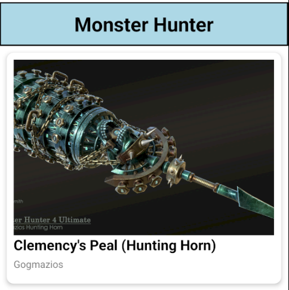
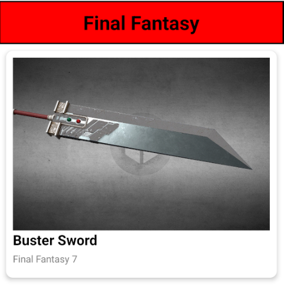

# Monster Hunter & Final Fantasy Weapons App

## What is the app about?

This is a simple React Native app that displays a list of my favourite 3D models of iconic weapons from different games.
The app uses a SectionList to group weapons by their respective game series. Each weapon entry shows:

Weapon image

Weapon name

Origin / series of the weapon

Clicking a weapon will display a fun toast notification.

## Below are some screenshots of the app:

<table>
  <tr>
    <td></td>
    <td></td>
  </tr>
</table>

